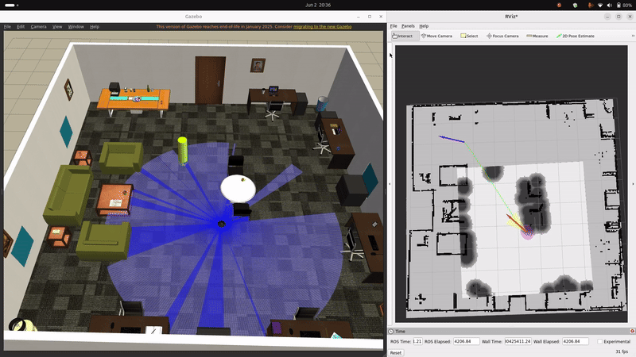
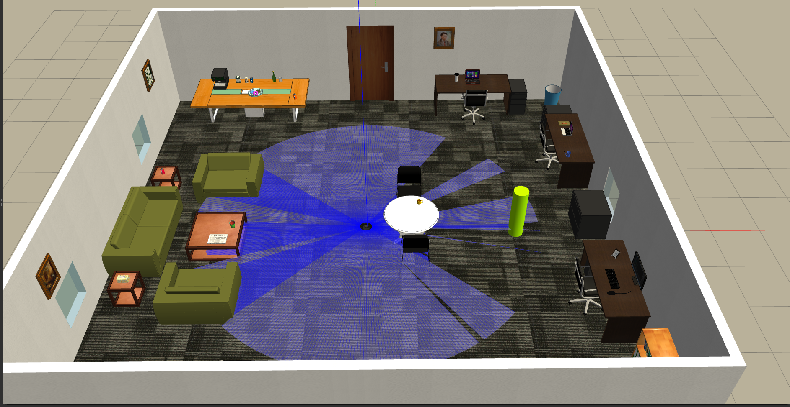
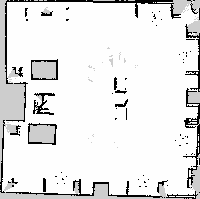

# Ros2-Nav2-Autonomous-Naviagtion-in-custom-Gazebo-Environments
This project demonstrates autonomous navigation of a TurtleBot3 Burger in custom Gazebo simulation environments using ROS2 and Nav2. The system performs mapping, localization, path planning, and obstacle avoidance using LiDAR-based perception.

The project was developed to gain practical experience with ROS2 middleware, Gazebo simulation, Nav2 integration, launch-file customization, TF2 debugging, and autonomous mobile robot navigation

## Demonstration
Below are various links to simulation videos uploaded on YouTube
- Localization and Autonomous Navigation  
[Autonomous Navigation without dynamic object](https://youtu.be/0sUM-3r76wAhttps://youtu.be/0sUM-3r76wA)

- Dynamic Obstacle Avoidance  
  [Autonomous Navigation when object moves in a straight path](https://youtu.be/yY6UaBc8PEA)  
  [Autonomous Navigation when object moves in a circular path](https://youtu.be/lQ0bsI1Gmq4)

A simulation GIF

## Features
- Autonomous navigation using ROS2 Nav2
- LiDAR-based SLAM and map generation
- AMCL localization on previously generated maps
- Obstacle-aware path planning
- Dynamic obstacle avoidance
- Integration of custom Gazebo environments
- Custom ROS2 launch-file architecture
## World & Mapping Showcase
### Office Simulation Environment with robot spawned  
  

### SLAM Mapping Result  

## Software Stack
- ROS2 Humble
- Gazebo Classic
- Nav2
- RViz2

## Installation
Clone the repository into a ROS2 workspace:
<pre>mkdir -p ~/ros2_ws/src
cd ~/ros2_ws/src
git clone https://github.com/Adi3339/Ros2-Nav2-Autonomous-Naviagtion-in-custom-Gazebo-Environments.git</pre> 

We'd also need Gazebo model assets for the custom office world
<pre>cd ~/ros2_ws/src/Ros2-Nav2-Autonomous-Naviagtion-in-custom-Gazebo-Environments/my_project
git clone --filter=blob:none --sparse https://github.com/leonhartyao/gazebo_models_worlds_collection.git
cd gazebo_models_worlds_collection
git sparse-checkout set models</pre>

Build the workspace:
<pre>cd ~/ros2_ws
colcon build --packages-select my_project dynamic_nav_cpp
source install/setup.bash</pre>
\* Install TurtleBot3 and Nav2 dependencies if not already present

## Running the Project
1. Launch Gazebo Environment with custom office world
<pre>cd ~/ros2_ws/src/Ros2-Nav2-Autonomous-Naviagtion-in-custom-Gazebo-Environments
export GAZEBO_MODEL_PATH=$(pwd)/my_project/gazebo_models_worlds_collection/models:$GAZEBO_MODEL_PATH
export TURTLEBOT3_MODEL=burger
ros2 launch my_project my_world.launch.py</pre>

2. Run the localization node: in a new terminal launch AMCL with a saved map
<pre>ros2 launch my_project my_localization.launch.py</pre>
\* Note: Whenever you open a new terminal source the workspace by entering:
<pre>cd ~/ros2_ws
source install/setup.bash</pre>

3. Launch Rviz2 in a new terminal and set initial pose
<pre>rviz2</pre>
\* Note: Set durability policy to 'transient local' instead of 'volatile' to avoid any visualization issues

4. Autonomous Navigation: in a new terminal launch navigation node
<pre>ros2 launch my_project my_navigation.launch.py</pre>

5. Dynamic Obstacle: in a new terminal run the obstacle mover node
<pre>source install/setup.bash
ros2 run dynamic_nav_cpp object_mover_1</pre>
\* Note: object_mover_1 moves cyclinder in a straight line, object_mover_2 in a circle

## Results
- Successful mapping of custom indoor environments
- Stable AMCL localization
- Autonomous navigation
- Dynamic obstacle avoidance and path replanning
- Integration of externally sourced Gazebo worlds and models

## Current Limitations
- Reactive Obstacle Avoidance:-  
The navigation stack reacts to obstacles after they are detected. Fast-moving obstacles or sudden trajectory changes may still result in collisions in certain scenarios.

- Conservative Costmap Configuration:-  
The global costmap is intentionally configured with conservative safety margins. As a result, some narrow passages that are physically possible to move by the robot are considered inaccessible.

- Simulation-Only Validation:-  
The project has currently been tested only in Gazebo simulation and has not yet been deployed on physical hardware.

## Future Improvements
- Predictive Obstacle Tracking:-  
Integrate obstacle motion prediction to improve navigation around dynamic agents and reduce collision risk.

- Adaptive Costmap Tuning:-  
To implement context-aware inflation and safety margins to allow navigation through narrow spaces while maintaining safety.

## Attribution
This project uses publicly available world and model assets adapted from the 'leonhartyao/gazebo_models_worlds_collection.git' repository.
All credit for the original assets goes to the respective authors.

Source: https://github.com/leonhartyao/gazebo_models_worlds_collection.git  
License: GNU General Public License v3.0

The assets were used to construct the custom office environment included in this project.
